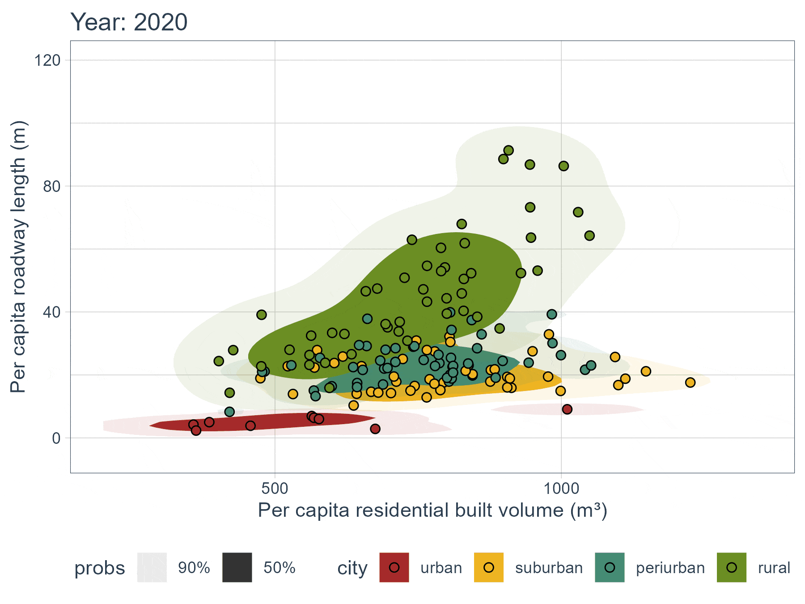
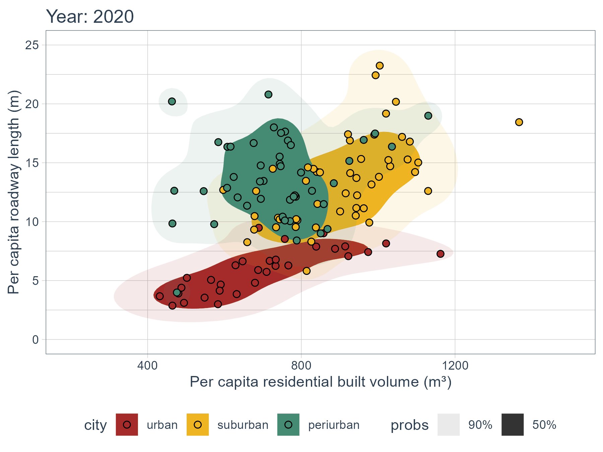

### Education
Ph.D. in Civil Engineering, University of Illinois Chicago, Chicago, IL (2025) \
Advisor: Prof. Sybil Derrible \
Dissertation Title: The Impacts of Depopulation on Infrastructure

M.Sc. in Civil and Transportation Engineering (2020) \
Bangladesh University of Engineering and Technology (BUET), Dhaka, Bangladesh \
Thesis Title: Joint modeling of pedestrian and motorcycle crashes in urban setting using copula approach

B.Sc. in Civil Engineering (2017) \
Bangladesh University of Engineering and Technology (BUET), Dhaka, Bangladesh 

### Projects 
### Impacts of depopulation on infrastructure- buildings and roadways (July 2023–May 2025)
- Extracted and processed data from the Global Human Settlement Layer (GHSL) and OpenStreetMap (OSM) database
- Forecasted residential built-up volume and roadway lane meters for U.S. cities up to 2100
- Assessed infrastructure burden in terms of per capita quantity change over time
- Findings of the project

**Median per capita RL (m/person) vs. median per capita RBUV (m3/person) by city type for each state**

(a) cities with a population ≤ 10,000

(b) cities with a population > 10,000

 
The darker transparency includes the distribution of 50% of the data points and the lighter transparency includes the distribution of 90% of the data points. Here, each data point represents the median value of per capita infrastructure for cities by state and city type category. With 50 states and 4 city types, each plot shows 200 data points. In this figure, an upward (right) shift indicates that per capita median value increases, thus an increasing burden. Conversely, a downward (left) shift means a lower burden. 

####	Depopulation in Illinois: Understanding and Forecasting Impacts on Transportation (May 2021-June 2023)
- Identified population trends in cities in Illinois
- Developed a survey to identify transportation challenges in depopulating cities in Illinois
- Forecasted population trend for cities in Illinois for five SSPs based on the dataset developed by Hauer (2019) and NCAR data
- Findings of this project can be accessed here [https://depopulation.digital.uic.edu/]

####	Investigating Attitudinal and Behavioral Changes in US Households Before, During, and After the COVID-19 Pandemic (October 2020-April 2021) 
- Worked to identify the scope of data imputation on completing the missing values in the survey data. Trying different available data imputation tools around 60% accuracy can be achieved in imputing the data.

________________________________________
### Publications
Journal Articles
1.	Chauhan, R.S., Sutradhar, U., Rozhkov, A. et al. (2025). Causation versus prediction in travel mode choice modeling. npj. Sustain. Mobil. Transp. 2, 5. 
2.	Sutradhar, U., Spearing, L., & Derrible, S. (2024). Depopulation and associated challenges for US cities by 2100. Nature Cities, 1(1), 51-61.
3.	Sutradhar, U., Badhrudeen, M., Chauhan, R. S., & Derrible, S. (2023). A survey to investigate transport conditions in depopulating cities in Illinois. Transportation Research Interdisciplinary Perspectives, 21, 100886.
4.	Chauhan, R. S., da Silva, D. C., Salon, D., Shamshiripour, A., Rahimi, E., Sutradhar, U., Khoeini, S., Mohammadian, A.K., Derrible, S., & Pendyala, R. (2021). COVID-19 related attitudes and risk perceptions across urban, rural, and suburban areas in the United States. Urban Findings, 23714.
Under Review / arXiv Papers / Perspectives
5.	Sutradhar, U., Spearing, L., Zou, B., Chester, M., & Derrible, S. (2024). Evolution of infrastructure burden in US cities by 2100. Under review.
6.	Sutradhar, U., Spearing, L., Chester, M., Zou, B., Mohammadian, A. K., Kawamura, K., & Derrible, S. (2025). Depopulation: Infrastructure Challenges and Opportunities. Under review.

Conference Presentations
1.	Chauhan, R. S., Sutradhar, U., Rozhkov, A., & Derrible, S. (2025). "Causation versus Prediction in Travel Mode Choice Modeling”. TRB 104th Annual Meeting, Transportation Research Board, January 5-9, Washington DC, United States.
2.	Sutradhar, U., Derrible, S. (2024). “Burden or Blessing! Quantifying Infrastructure in the Chicago Metropolitan Area”, Transport Chicago, June 14, Chicago, IL, United States.
3.	Sutradhar, U., Benavides Lara, M. F., & Derrible, S. (2024). "Who pays for the additional maintenance costs: per capita roadway length in response to the changing demographics in U.S. cities to 2050?", TRB 103rd Annual Meeting, Transportation Research Board, January 7-11, Washington DC, United States.
4.	Sutradhar, U., Haas, N. A., Zigulich, M., & Derrible, S. (2022). Investigating the Impacts of Depopulation and Climate Change on Water Infrastructure: A Study of Northeastern Illinois. In AGU Fall Meeting Abstracts (Vol. 2022, pp. GC22D-04).
5.	Zigulich, M., Derrible, S., Haas, N. A., & Sutradhar, U. (2022). Green Infrastructure Design Storms: A Machine Learning Approach to Construct Short Duration Design Storms. In AGU Fall Meeting Abstracts (Vol. 2022, pp. H22O-1000).
6.	Das, T., Sutradhar, U., Faruque, G. M., Hadiuzzaman, M., & Mashrur, S. M. (2019). Exploring Heterogeneity in Perception of Service Quality among Groups of Passenger Ferry Users. In International Conference on Transportation and Development 2019: Smarter and Safer Mobility and Cities (pp. 466-476). Reston, VA: American Society of Civil Engineers.

________________________________________
### Skills
#### Programming Languages & Tools	
Python (Pandas, Numpy, matplotlib, plotly, statsmodel, SciPy, Scikit‑learn, Networkx, osm2gmns, geopandas, shapely, TensorFlow, NLTK, beautifulsoup, Selenium etc.)
                                R (sf, terra, exactextractr, dplyr, raster, tidyr, data.table, tidyverse, ggplot2, ggspatial, tmap)
                                MATLAB 
#### Data Analysis	
Statistical techniques (Discrete Choice, Copula), Machine Learning (Regression, Classification, Clustering), LangChain 
####	Software
GREET, MOVES, EMME, PTV Vissim, ArcGIS, QGIS, AutoCAD, ETABS, BIOGEME, basic SQL, Microsoft Offices 

### Training and Workshops
•	Intro to AI-driven Science on Supercomputers, Argonne National Laboratory

•	The Future of Urban Accessibility: The Role of AI, ASSETS'24 

•	Envisioning Equitable Transitions to Sustainable Transportation Systems, Institute for Sustainability, Energy, and Environment (iSEE)

•	Introduction to EMME, online training on EMME basics including data management and network editing, multimodal network modelling, mapping (2D and 3D), analysis and scenario evaluation using EMME Desktop and Modeller.

### Honors and Awards
•	WTS Greater Chicago Chapter - President’s Scholarship (2022-23)

